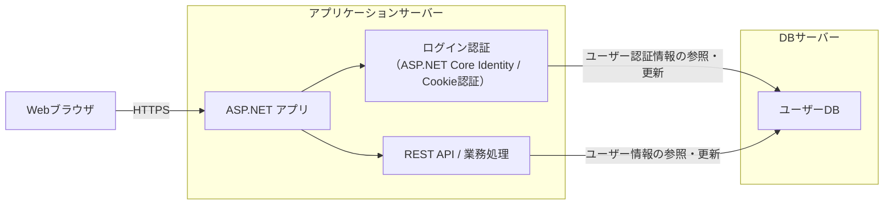
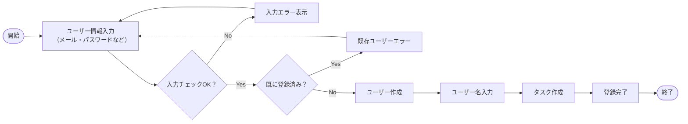
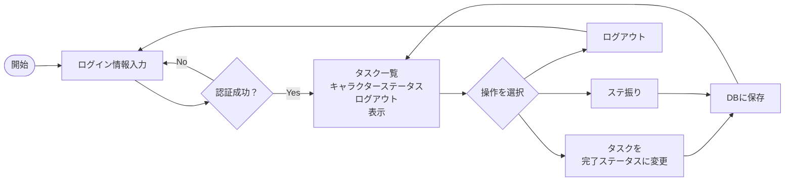
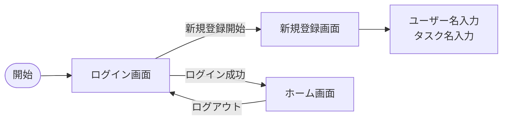

習慣化の勇者

# システム概要

毎日楽しく続けられる習慣化タスク管理アプリ  
「運動・勉強・家事」カテゴリ毎に1つ続けたいタスクを設定し、完了出来たら完了ステータスに変更する。  
GitHubの草のシステムのように過去どれだけタスクを完了させたか可視化し、継続しようと思わせるようにする。  
完了ステータスに変更した時、カテゴリ毎にキャラクターのステータスに振り分けるためのポイントが3ポイント貰える。  
どのステータスにも振れるわけではなく、運動の場合はHP・攻撃力、勉強はMP・魔法攻撃力、家事は防御力・速度と制限がある。  
そうしてステータスを増やす事によってキャラクターを強くしていく。  
後々育てたキャラクターをダンジョンに行かせたり、プレイヤー同士バトルさせたり、装備させたりRPG要素を追加する構想あり。  

## システム構成図

本システムは Web ブラウザから利用する ASP.NET ベースの Web アプリケーションである。  
利用者はログイン機能により個別のアカウントで認証され、ユーザーごとの情報を管理する。  
認証には ASP.NET Core Identity を利用し、認証情報およびユーザーデータは DB サーバーで管理する。  
アプリケーション内部の処理は REST 形式の設計方針を採用する。

## 背景

習慣化するのにタスクアプリを利用するが、三日坊主になってしまう。  
そのためゲーム要素を取り入れて、毎日続けられるようなタスク管理アプリが欲しい

# 業務要件

## 業務フロー

初回の登録の業務フロー図

登録済みの業務フロー図

## 規模

- 月間処理件数 : 300件（10人×30日）
- 同時ログインユーザー数 : 10人

## 時期・時間

同時接続者数が少ないため省略

## 指標

3日後の継続利用率：<b>30％以上</b>  
7日後の継続利用率：<b>10％以上</b>  
30日後の継続利用率：<b>5％以上</b>

## 範囲

### 対象範囲

- ユーザー登録 / ログイン機能
- 毎日のタスクの登録 / 編集
- キャラクターのステータス振り
- 過去のタスク完了率の確認

### 対象範囲外

- タスクの削除
- SNSログイン（Google / Apple）
- 課金機能

#### ※将来的に実装する可能性のある項目

- ユーザー名の変更
- キャラクターの戦闘システム
- ランキング
- モバイルアプリ対応

## 対象ユーザー

- URLを知らせた友人・知人（一般ユーザー）

# 機能要件

## 機能

| 分類         | 内容                                 | 説明                                                                                                             |
| ------------ | ------------------------------------ | ---------------------------------------------------------------------------------------------------------------- |
| ユーザー管理 | ユーザーの新規登録                   | ログイン出来るようにメールアドレス・パスワードを設定して登録する                                                 |
| ユーザー管理 | ユーザー名の設定                     | 新規登録とユーザー名設定のフェーズを分けるため                                                                   |
| タスク管理   | タスクの新規登録                     | 毎日行うタスクを登録する                                                                                         |
| タスク管理   | タスクの表示                         | 毎日行うタスクを表示する                                                                                         |
| タスク管理   | タスク名の変更                       | 毎日行うタスク名を変更する                                                                                       |
| タスク管理   | タスクの完了                         | タスクを完了を実行すると完了表示に切り替わる                                                                     |
| タスク管理   | タスクリセット                       | 日付が変わった時、完了状態のタスクが未完了状態の表示に切り替わる                                                 |
| キャラクター | ステータスポイント・ステータスの表示 | 所持しているステータスポイント・振り分けたステータスの可視化                                                     |
| キャラクター | キャラクターのステータスポイント付与 | タスクを完了を実行するとタスクに応じたステータスポイントが付与される                                             |
| キャラクター | ステータスポイントの振り分け         | 所持しているステータスポイントに応じて該当のステータスを振り分けられる 振り分けた分のステータスポイントは減る |

## 画面

### 画面一覧

| 画面ID | 画面名       | 目的・役割                                                     |
| ------ | ------------ | -------------------------------------------------------------- |
| SCR001 | ログイン画面 | メールアドレス・パスワードを入力してログインする               |
| SCR002 | 新規登録画面 | メールアドレス・パスワードを設定してユーザーを新しく登録する   |
| SCR003 | ホーム画面   | メインの画面、タスク一覧やキャラクターのステータスが表示される |

### 画面遷移図

## 情報・データログ

### データモデル

| テーブル名       | 項目名                                 | 型   | 制約         | 詳細           |
| ---------------- | -------------------------------------- | ---- | ------------ | -------------- |
| ユーザーテーブル | ユーザーID                             | INT  | 主キー、連番 | ユーザーID     |
| ユーザーテーブル | ユーザー名                             | TEXT | 32文字以内   | ユーザーの名前 |
| ユーザーテーブル | キャラクターステータス(HP)             | INT  |              |                |
| ユーザーテーブル | キャラクターステータス(MP)             | INT  |              |                |
| ユーザーテーブル | キャラクターステータス(ATK)            | INT  |              |                |
| ユーザーテーブル | キャラクターステータス(DEF)            | INT  |              |                |
| ユーザーテーブル | キャラクターステータス(SPD)            | INT  |              |                |
| ユーザーテーブル | キャラクターステータス(INT)            | INT  |              |                |
| ユーザーテーブル | 未振り分けのステータスポイント（運動） | INT  |              |                |
| ユーザーテーブル | 未振り分けのステータスポイント（勉強） | INT  |              |                |
| ユーザーテーブル | 未振り分けのステータスポイント（家事） | INT  |              |                |
| ユーザーテーブル | タスク名（運動）                       | TEXT |              |                |
| ユーザーテーブル | タスク名（勉強）                       | TEXT |              |                |
| ユーザーテーブル | タスク名（家事）                       | TEXT |              |                |

### ログ

## 外部インターフェイス

特に無し

# 非機能要件

今後入力予定
