# DB設計書

## ER図

```mermaid
erDiagram
    AspNetUsers ||--|| CharacterStats : "1対1"
    AspNetUsers ||--|| UnallocatedPoints : "1対1"
    AspNetUsers ||--o{ Tasks : "1対多"
    Tasks ||--o{ TaskCompletionLogs : "1対多"

    AspNetUsers {
        string Id PK
        string DisplayName
        string Email
        string PasswordHash
        bool IsInit
    }

    Tasks {
        int TaskId PK
        string UserId FK
        int Category "0=運動 1=勉強 2=家事"
        string TaskName
        date LastCompletedDate
        bool IsDeleted
    }

    TaskCompletionLogs {
        bigint LogId PK
        string UserId FK
        int TaskId FK
        date CompletedAt
    }

    CharacterStats {
        int CharacterStatId PK
        string UserId FK
        int HP
        int MP
        int ATK
        int DEF
        int SPD
        int MATK
    }

    UnallocatedPoints {
        int PointId PK
        string UserId FK
        int ExercisePoints
        int StudyPoints
        int HouseworkPoints
    }
```

---

## テーブル定義

### AspNetUsers（ASP.NET Core Identity 拡張）

ASP.NET Core Identity が管理する標準テーブルを拡張する。
メールアドレス・パスワードハッシュ等の認証情報は Identity が自動管理するため、下記は追加カラムのみ記載する。

| カラム名     | 型            | 制約                              | 説明                                                             |
| ------------ | ------------- | --------------------------------- | ---------------------------------------------------------------- |
| Id           | NVARCHAR(450) | PK（Identity 標準）               | ユーザーID（GUID）                                               |
| DisplayName  | NVARCHAR(32)  | NOT NULL, DEFAULT ''              | アプリ内表示名。ユーザー登録時は空文字で作成し、SCR007で更新する |
| Email        | NVARCHAR(256) | NOT NULL, UNIQUE（Identity 標準） | メールアドレス                                                   |
| PasswordHash | NVARCHAR(MAX) | （Identity 標準）                 | パスワードハッシュ                                               |
| IsInit       | BIT           | NOT NULL, DEFAULT 0               | 初期設定完了フラグ。SCR007での設定完了時に1へ更新する            |
| ...          | ...           | ...                               | その他 Identity 標準カラム                                       |

---

### Tasks（タスクテーブル）

ユーザーが登録する習慣タスクを管理する。
1ユーザーにつきカテゴリごとに1件のみ登録可能とするか検討中（仕様未確定）。
削除は論理削除とし、IsDeleted フラグで管理する。

| カラム名          | 型            | 制約                          | 説明                                                                            |
| ----------------- | ------------- | ----------------------------- | ------------------------------------------------------------------------------- |
| TaskId            | INT           | PK, AUTO_INCREMENT            | タスクID                                                                        |
| UserId            | NVARCHAR(450) | FK → AspNetUsers.Id, NOT NULL | ユーザーID                                                                      |
| Category          | TINYINT       | NOT NULL                      | カテゴリ（0=運動 / 1=勉強 / 2=家事）                                            |
| TaskName          | NVARCHAR(100) | NOT NULL, DEFAULT ''          | タスク名。ユーザー登録時は空文字で作成し、SCR007で更新する                      |
| LastCompletedDate | DATE          | NULL                          | 最後に完了した日付。当日日付と一致する場合「完了済み」と判定する。NULL は未完了 |
| IsDeleted         | BIT           | NOT NULL, DEFAULT 0           | 論理削除フラグ                                                                  |

**インデックス・制約**

- UNIQUE (UserId, Category) ：1ユーザーにつき同一カテゴリのタスクは1件のみ（※仕様未確定）

> **タスクリセットの実現方法**
> 日付変わりのリセット処理はバックグラウンドジョブではなく、クエリ時に `LastCompletedDate < 本日` であれば「未完了」と判定する方式とする。
> 更新コストがなく、シンプルに実現できる。

---

### TaskCompletionLogs（タスク完了履歴テーブル）

タスクを完了した履歴を蓄積する。
GitHubの草のような「完了履歴の可視化」に使用する。
カテゴリは TaskId を通じて Tasks テーブルから取得する。

| カラム名    | 型            | 制約                          | 説明                                 |
| ----------- | ------------- | ----------------------------- | ------------------------------------ |
| LogId       | BIGINT        | PK, AUTO_INCREMENT            | ログID                               |
| UserId      | NVARCHAR(450) | FK → AspNetUsers.Id, NOT NULL | ユーザーID（集計クエリ用に冗長持ち） |
| TaskId      | INT           | FK → Tasks.TaskId, NOT NULL   | タスクID                             |
| CompletedAt | DATE          | NOT NULL                      | 完了日（JST）                        |

**インデックス・制約**

- UNIQUE (TaskId, CompletedAt) ：同一タスクの同日完了は1件のみ
- INDEX (UserId, CompletedAt) ：草表示の集計クエリ用

---

### CharacterStats（キャラクターステータステーブル）

ユーザーのキャラクターステータスを管理する。
ユーザーと1対1の関係。ユーザー登録時に初期値で1件作成する。

| カラム名        | 型            | 制約                                  | 説明                                                             |
| --------------- | ------------- | ------------------------------------- | ---------------------------------------------------------------- |
| CharacterStatId | INT           | PK, AUTO_INCREMENT                    | ステータスID                                                     |
| UserId          | NVARCHAR(450) | FK → AspNetUsers.Id, NOT NULL, UNIQUE | ユーザーID                                                       |
| HP              | INT           | NOT NULL, DEFAULT 10                  | HP（運動ポイントで上昇可）                                       |
| MP              | INT           | NOT NULL, DEFAULT 10                  | MP（勉強ポイントで上昇可）                                       |
| ATK             | INT           | NOT NULL, DEFAULT 10                  | 攻撃力（運動ポイントで上昇可）                                   |
| DEF             | INT           | NOT NULL, DEFAULT 10                  | 防御力（家事ポイントで上昇可）                                   |
| SPD             | INT           | NOT NULL, DEFAULT 10                  | 速度（家事ポイントで上昇可）                                     |
| MATK            | INT           | NOT NULL, DEFAULT 10                  | 魔法攻撃力（勉強ポイントで上昇可）※INTは予約語のため MATK とする |

---

### UnallocatedPoints（未振り分けポイントテーブル）

タスク完了で獲得したが、まだステータスに振り分けていないポイントを管理する。
ユーザーと1対1の関係。ユーザー登録時に初期値(0)で1件作成する。

| カラム名        | 型            | 制約                                  | 説明                                                       |
| --------------- | ------------- | ------------------------------------- | ---------------------------------------------------------- |
| PointId         | INT           | PK, AUTO_INCREMENT                    | ポイントID                                                 |
| UserId          | NVARCHAR(450) | FK → AspNetUsers.Id, NOT NULL, UNIQUE | ユーザーID                                                 |
| ExercisePoints  | INT           | NOT NULL, DEFAULT 0                   | 運動カテゴリの未振り分けポイント（HP / ATK に振り分け可）  |
| StudyPoints     | INT           | NOT NULL, DEFAULT 0                   | 勉強カテゴリの未振り分けポイント（MP / MATK に振り分け可） |
| HouseworkPoints | INT           | NOT NULL, DEFAULT 0                   | 家事カテゴリの未振り分けポイント（DEF / SPD に振り分け可） |

---

## ステータスポイントの振り分けルール

| カテゴリ | 振り分け可能なステータス |
| -------- | ------------------------ |
| 運動     | HP、ATK                  |
| 勉強     | MP、MATK                 |
| 家事     | DEF、SPD                 |

- タスク完了ごとに該当カテゴリの `UnallocatedPoints` が **+3** される
- ユーザーが任意のタイミングでポイントを消費し、対応するステータスを上昇させる
- 1ポイント消費 = 対象ステータス +1

---

## 初期データ作成タイミング

### ユーザー登録時（SCR002）

ユーザー登録完了時に、以下のレコードをトランザクション内で一括作成する。

1. `CharacterStats` × 1件（全ステータス初期値 10）
2. `UnallocatedPoints` × 1件（全ポイント 0）

### 初期設定入力時（SCR007）

初期設定完了時に、以下のレコードを作成・更新する。

1. `Tasks` × 3件（運動 / 勉強 / 家事）。入力されたタスク名で新規作成する
2. `AspNetUsers.DisplayName` をキャラクター名で更新する
3. `AspNetUsers.IsInit` を `1`（true）に更新する

> AspNetUsers.IsInit は登録時 `0`（false）で作成し、SCR007 での設定完了時に `1`（true）へ更新する。
