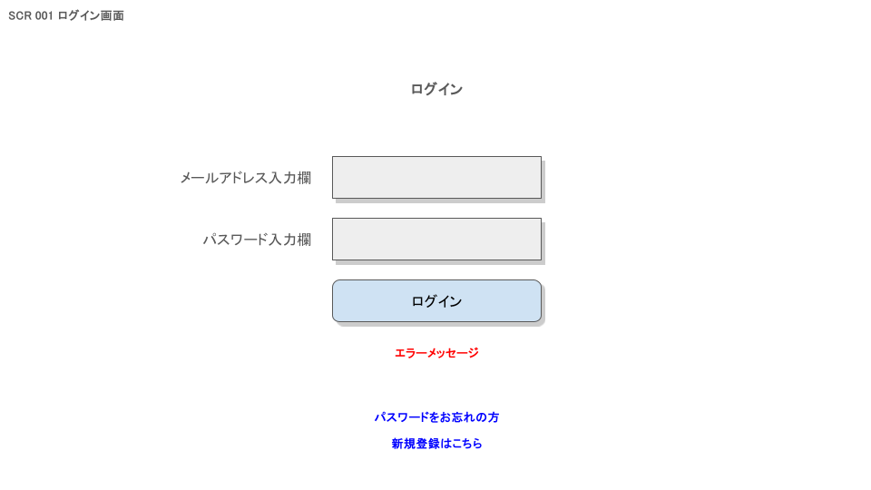
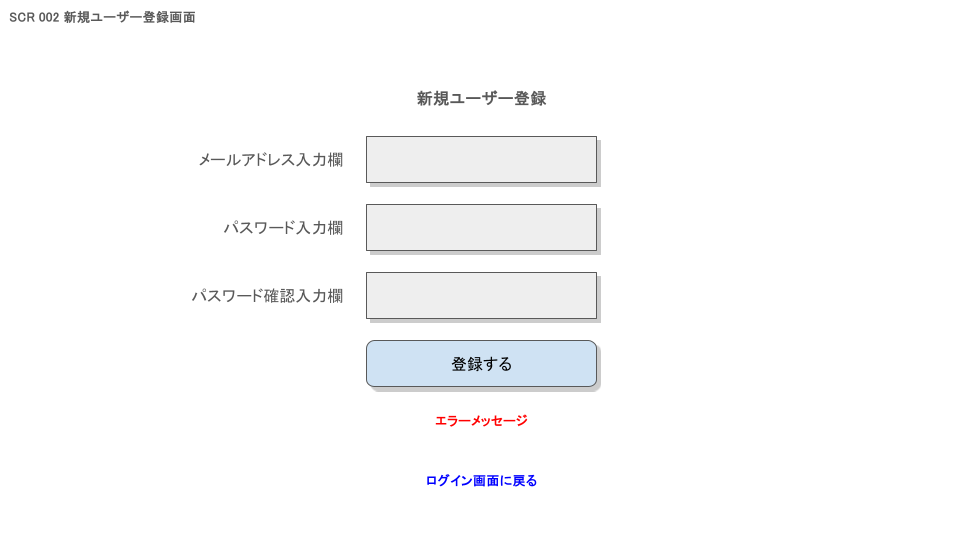
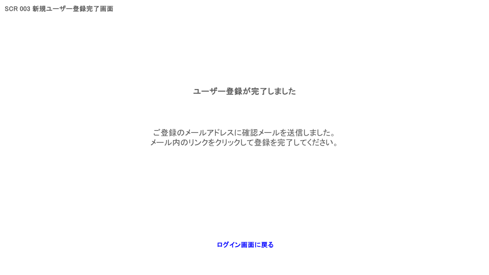
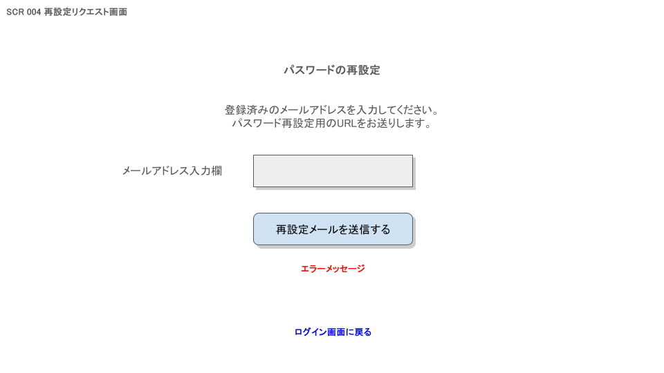
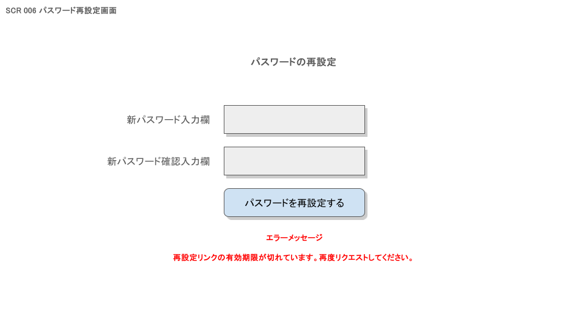
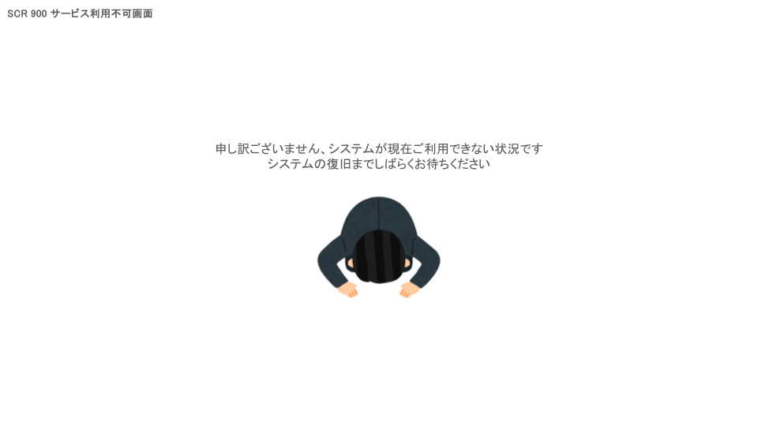

# 機能設計書

---

# ログイン画面（SCR001）

## ログイン認証

### 処理内容

メールアドレス・パスワードをPOST送信し、ASP.NET Core IdentityのCookie認証で認証処理を行う。  
認証成功時は `AspNetUsers.IsInit` を確認し、`false` なら SCR007、`true` なら SCR008 へリダイレクトする。

### 必要なデータ

- メールアドレス
- パスワード

### 取得元

- ユーザー入力フォーム

### ユーザー操作

1. メールアドレス・パスワードを入力する
2. ログインボタンを押下する

---

# 新規ユーザー登録画面（SCR002）

## ユーザー登録

### 処理内容

メールアドレス・パスワードを POST 送信し、ASP.NET Core Identity でユーザーを作成する。  
登録成功時、確認メールを送信する。

### 必要なデータ

- メールアドレス
- パスワード
- パスワード（確認）

### 取得元

- ユーザー入力

### ユーザー操作

1. メールアドレス・パスワード・パスワード（確認）を入力する
2. 登録するボタンを押下する

---

# 新規ユーザー登録完了画面（SCR003）

## 登録完了案内

### 処理内容

確認メールの送信完了を案内するメッセージを表示する。サーバー処理・DBアクセスなし。

### 必要なデータ

- なし

### 取得元

- なし

### ユーザー操作

1. メッセージを確認する
2. ログイン画面に戻るリンクを押下する（SCR001へ遷移）

---

# 再設定リクエスト画面（SCR004）

## パスワード再設定メール送信

### 処理内容

入力されたメールアドレスを POST 送信する。  
メールアドレスが `AspNetUsers` に登録済みの場合のみ、パスワード再設定リンクをメール送信する。

### 必要なデータ

- メールアドレス

### 取得元

- ユーザー入力

### ユーザー操作

1. メールアドレスを入力する
2. 再設定メールを送信するボタンを押下する

---

# 再設定リクエスト完了画面（SCR005）

## 送信完了案内

### 処理内容

再設定メールの送信完了を案内するメッセージを表示する。サーバー処理・DBアクセスなし。　　

### 必要なデータ

- なし

### 取得元

- なし

### ユーザー操作

1. メッセージを確認する
2. ログイン画面に戻るリンクを押下する（SCR001へ遷移）

---

# パスワード再設定画面（SCR006）

## パスワード再設定

### 処理内容

ASP.NET Core Identity のパスワードリセット処理を実行する。  
トークンが無効または期限切れの場合はエラーメッセージを表示する。  
再設定成功後は SCR001 へ遷移する（再設定後に自動ログインはしない）

### 必要なデータ

- 新しいパスワード
- 新しいパスワード（確認）
- リセットトークン（URLクエリパラメーター）
- メールアドレス（URLクエリパラメーター）

### 取得元

- ユーザー入力（パスワード）
- URLパラメーター（トークン・メールアドレス）

### ユーザー操作

1. 新しいパスワード・パスワード（確認）を入力する
2. パスワードを再設定するボタンを押下する

---

# 初期設定入力画面（SCR007）

## 初期設定登録

### 処理内容

キャラクター名・3カテゴリのタスク名を POST 送信する。
以下の処理をトランザクション内で一括実行する。

- `AspNetUsers.DisplayName` をキャラクター名で更新する
- `Tasks` × 3件（Category: 0=運動 / 1=勉強 / 2=家事）を入力されたタスク名で新規作成する
- `CharacterStats` × 1件（全ステータス初期値 10）を作成する
- `UnallocatedPoints` × 1件（全ポイント 0）を作成する
- `AspNetUsers.IsInit` を `true` に更新する

### 必要なデータ

- キャラクター名（DisplayName）
- 運動タスク名
- 勉強タスク名
- 家事タスク名

### 取得元

- ユーザー入力

### ユーザー操作

1. キャラクター名・各タスク名を入力する
2. 設定を保存して始めるボタンを押下する

---

# ホーム画面（SCR008）

## ホーム情報取得

### 処理内容

ページ表示時に GET リクエストでログインユーザーの以下データを取得して画面に表示する。

- タスク一覧（`Tasks`）：`LastCompletedDate` が本日と一致する場合グレーアウトする
- キャラクターステータス（`CharacterStats`）
- 未振り分けポイント（`UnallocatedPoints`）
- キャラクター名（`AspNetUsers.DisplayName`）
- レベル：`TaskCompletionLogs` の `COUNT(*)` をレベル値として使用する

### 必要なデータ

- ログインユーザーID

### 取得元

- `Tasks`、`CharacterStats`、`UnallocatedPoints`、`AspNetUsers`、`TaskCompletionLogs`

### ユーザー操作

- 画面を表示する（自動取得）

---

## タスク完了

### 処理内容

タスクボタン押下時に POST リクエストを送信し、以下を実行する。

- `Tasks.LastCompletedDate` を本日の日付に更新する
- 対応カテゴリの `UnallocatedPoints` を +1 する
- `TaskCompletionLogs` にレコードを INSERT する

同一タスクの同日重複完了は不可（`TaskCompletionLogs` の UNIQUE 制約により防止）。

| タスクカテゴリ | 付与されるポイント |
| -------------- | ------------------ |
| 運動（0）      | ExercisePoints +1  |
| 勉強（1）      | StudyPoints +1     |
| 家事（2）      | HouseworkPoints +1 |

### 必要なデータ

- TaskId
- ログインユーザーID

### 取得元

- ユーザー操作（タスクボタン押下）

### ユーザー操作

1. 未完了のタスクボタン（運動 / 勉強 / 家事）を押下する
2. 画面が最新状態に更新される

---

## ステータスポイント振り分け

### 処理内容

+/- ボタンで仮振り分けを行い、確定ボタン押下で POST リクエストを送信する。
以下を実行する。

- `UnallocatedPoints` の対応カテゴリポイントを消費分だけ減算する
- `CharacterStats` の対応ステータスを加算する

振り分けルールはカテゴリ別に制限される。1ポイント消費で対象ステータス +1。

| カテゴリ | 振り分け可能なステータス |
| -------- | ------------------------ |
| 運動     | HP、ATK                  |
| 勉強     | MP、MATK                 |
| 家事     | DEF、SPD                 |

### 必要なデータ

- 振り分け対象ステータスと消費ポイント数
- ログインユーザーID

### 取得元

- ユーザー操作（+/-ボタンによる仮振り分け）

### ユーザー操作

1. +/-ボタンで振り分けたいステータスを選択する（仮振り分け）
2. 振り分けを適用するボタンを押下して確定する

---

## タスク完了履歴表示

### 処理内容

`TaskCompletionLogs` を集計し、過去の完了履歴をカレンダー形式（草）で表示する。

### 必要なデータ

- ログインユーザーID

### 取得元

- `TaskCompletionLogs`

### ユーザー操作

- 画面を表示する（自動取得）

---

## ログアウト

### 処理内容

POST リクエストでCookie認証セッションを無効化し、SCR001 へリダイレクトする。

### 必要なデータ

- なし

### 取得元

- なし

### ユーザー操作

1. ログアウトリンクを押下する

---

# サービス利用不可画面（SCR900）

## サービス利用不可通知

### 処理内容

DBアクセスを行わない静的HTMLとして表示する。
DB障害等によりいずれの画面からも本画面へ遷移しうる。

### 必要なデータ

- なし

### 取得元

- なし

### ユーザー操作

1. メッセージを確認する
