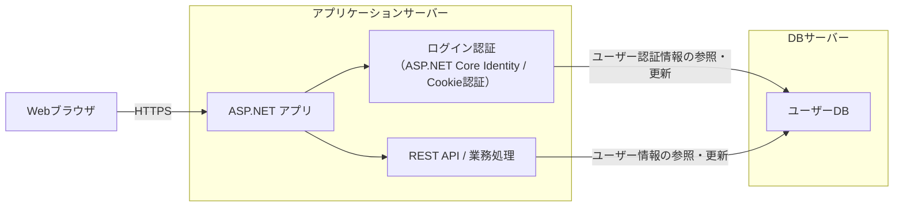
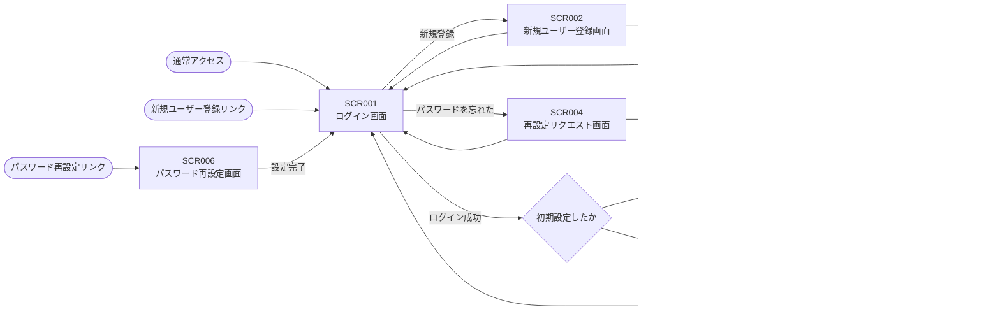

# アプリ名

習慣化の勇者

# バージョン

1.0.2

# システム概要

本システムは、ユーザーが継続して長期間取り組みたい行動を、楽しみながら習慣化できるよう支援するタスク管理アプリケーションである。  
ユーザーは「運動」「勉強」「家事」といったカテゴリに分類されたタスクを登録し、日々のタスクを完了することで、アプリ内のキャラクターを成長させることができる。  
タスクを完了すると、対応するカテゴリに応じたステータスポイントが付与される。運動はHPおよび攻撃力、勉強はMPおよび魔法攻撃力、家事は防御力および速度に対応しており、ユーザーの行動内容に応じてキャラクターの成長内容が変化する。  
本システムは、タスク管理とRPG要素を組み合わせたゲーミフィケーションにより、ユーザーの継続的な利用を促進することを目的とする。  
また、将来的には育成したキャラクターを用いたダンジョン探索、ユーザー間での対戦機能、装備要素の追加など、RPG要素の拡張を予定している。

## システム構成図

本システムは Web ブラウザから利用する ASP.NET ベースの Web アプリケーションである。  
利用者はログイン機能により個別のアカウントで認証され、ユーザーごとの情報を管理する。  
認証には ASP.NET Core Identity を利用し、認証情報およびユーザーデータは DB サーバーで管理する。  
アプリケーション内部の処理は REST 形式の設計方針を採用する。

## 背景

習慣化するのにタスクアプリを利用するが、三日坊主になってしまう。  
そのためゲーム要素を取り入れて、毎日続けられるようなタスク管理アプリが欲しい

# 業務要件

## 規模

- 月間処理件数 : 300件（10人×30日）
- 同時ログインユーザー数 : 10人

## 時期・時間

同時接続者数が少ないため省略

## 指標

3日後の継続利用率：<b>30％以上</b>  
7日後の継続利用率：<b>10％以上</b>  
30日後の継続利用率：<b>5％以上</b>

## 範囲

### 対象範囲

- ユーザー登録 / ログイン機能
- 毎日のタスクの登録
- キャラクターのステータス振り
- 過去のタスク完了率の確認

### 対象範囲外

- タスクの削除
- SNSログイン（Google / Apple）
- 課金機能

#### ※将来的に実装する可能性のある項目

- タスク名の編集
- キャラクター名の変更
- キャラクターの戦闘システム
- ランキング
- モバイルアプリ対応

## 対象ユーザー

- URLを知らせた友人・知人（一般ユーザー）

# 機能要件

## 機能

| 分類         | 内容                                 | 説明                                                                                                             |
| ------------ | ------------------------------------ | ---------------------------------------------------------------------------------------------------------------- |
| ユーザー管理 | ユーザーの新規登録                   | ログイン出来るようにメールアドレス・パスワードを設定して登録する                                                 |
| ユーザー管理 | パスワード再設定                     | パスワードを忘れた時、メールアドレスを入力して再設定出来る                                                       |
| タスク管理   | タスクの新規登録                     | カテゴリ毎に分けられた3つの毎日行うタスクを登録する                                                              |
| タスク管理   | タスクの表示                         | 毎日行うタスクを表示する                                                                                         |
| タスク管理   | タスクの完了                         | タスクを完了を実行すると完了表示に切り替わる                                                                     |
| タスク管理   | タスクリセット                       | 日付が変わった時、完了状態のタスクが未完了状態の表示に切り替わる                                                 |
| タスク管理   | 過去のタスクの履歴表示               | 過去タスクの完了率がどれくらいか可視化出来る。GitHubの草のような表示を想定                                       |
| キャラクター | キャラクター名の新規設定             | 育てる自身のキャラクターの名前を設定出来る。                                                                     |
| キャラクター | ステータスポイント・ステータスの表示 | 所持しているステータスポイント・振り分けたステータスの可視化                                                     |
| キャラクター | キャラクターのステータスポイント付与 | タスクを完了を実行するとタスクに応じたカテゴリのステータスポイントが3ポイント付与される                          |
| キャラクター | ステータスポイントの振り分け         | 所持しているステータスポイントに応じて該当のステータスを振り分けられる 振り分けた分のステータスポイントは減る |

## 画面

### 画面一覧

| 画面ID | 画面名                                                                     | 目的・役割                                                                        |
| ------ | -------------------------------------------------------------------------- | --------------------------------------------------------------------------------- |
| SCR001 | [ログイン画面](/画面設計書/SCR001_ログイン画面.md)                         | メールアドレス・パスワードを入力してログインする                                  |
| SCR002 | [新規ユーザー登録画面](/画面設計書/SCR002_新規ユーザー登録画面.md)         | メールアドレス・パスワードを設定してユーザーを新しく登録する                      |
| SCR003 | [新規ユーザー登録完了画面](/画面設計書/SCR003_新規ユーザー登録完了画面.md) | 新規ユーザーの登録が完了し、メールアドレスを確認する画面                          |
| SCR004 | [再設定リクエスト画面](/画面設計書/SCR004_再設定リクエスト画面.md)         | メールアドレスを入力し、対象のメールアドレスにパスワードを再設定するURLを送信する |
| SCR005 | [再設定リクエスト完了画面](/画面設計書/SCR005_再設定リクエスト完了画面.md) | パスワードを再設定するURLを送信完了したことを知らせる画面                         |
| SCR006 | [パスワード再設定画面](/画面設計書/SCR006_パスワード再設定画面.md)         | 新しいパスワードを入力して再設定する                                              |
| SCR007 | [初期設定入力画面](/画面設計書/SCR007_初期設定入力画面.md)                 | キャラクター名、タスク名を新しく登録する                                          |
| SCR008 | [ホーム画面](/画面設計書/SCR008_ホーム画面.md)                             | メインの画面、タスク一覧やキャラクターのステータスが表示される                    |
| SCR900 | [サービス利用不可画面](/画面設計書/SCR900_サービス利用不可画面.md)         | 何らかの理由でサービスが使えない場合に表示する画面                                |

### 画面遷移図

> 共通遷移： DBサービスが利用不可の場合、いずれの画面からも SCR900（サービス利用不可画面）へ遷移する。

## 情報・データログ

### データモデル

[DB設計書](/DB設計書.md)

### ログ

ユーザー操作およびエラー情報をログとして記録する

## 外部インターフェイス

特に無し

# 非機能要件

## 可用性

本システムは、個人利用を想定した小規模なWebアプリケーションであるため、高可用性は求めないものとする。  
システムの稼働率は99.0%以上を目標とし、障害発生時には速やかに復旧対応を行う。  
また、DB接続不可等の障害発生時には、ユーザーに対してサービス利用不可画面を表示するものとする。

## セキュリティ（認証あり）

本システムは、ASP.NET Core Identity を用いた認証機能により、ユーザーごとに認証・認可を行う。  
通信はHTTPSを使用し、通信内容の盗聴および改ざんを防止する。  
パスワードはハッシュ化して保存し、平文での保存は行わない。

### パスワード規則

- 文字数は8文字以上とする
- 同一文字のみで構成されたパスワードは不可とする（少なくとも1文字は他と異なる文字を含むこと）
- 英小文字（a～z）を1文字以上含むこと
- 数字（0～9）を1文字以上含むこと

# ドキュメント更新履歴

| バージョン | 日付       | 変更履歴                                                                                                    |
| ---------- | ---------- | ----------------------------------------------------------------------------------------------------------- |
| 1.0.0      | 2026/03/31 | 初版作成                                                                                                    |
| 1.0.1      | 2026/04/01 | 画面一覧に画面設計書へのリンクを追加、画面遷移図に不足していた遷移（SCR002・SCR003・SCR004 → SCR001）を追加 |
| 1.0.2      | 2026/04/03 | セキュリティセクションにパスワード規則を追加                                                                |
