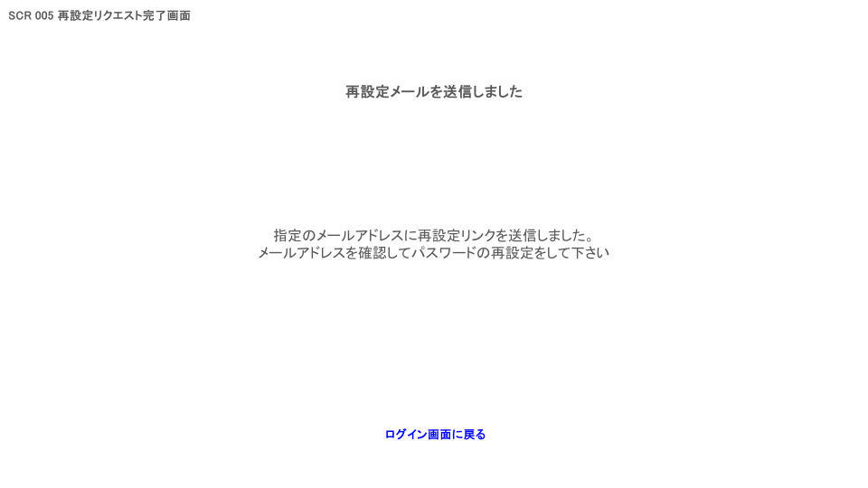

# 画面設計書

## 1. 基本情報

- 画面ID：SCR005
- 画面名：再設定リクエスト完了画面
- 対応URL：/account/forgot-password-confirmation
- 画面の目的：パスワード再設定URLの送信完了をユーザーに通知する
- 利用対象者：パスワード再設定リクエストを送信した一般ユーザー
- 関連機能：パスワード再設定
- 備考：メールアドレスの登録有無に関わらず同一メッセージを表示する（ユーザー列挙攻撃対策）

---

## 2. 画面概要

- この画面で実現すること：再設定メールの送信完了案内を表示する
- 表示タイミング：SCR004（再設定リクエスト画面）での送信成功後
- 前画面：SCR004 再設定リクエスト画面
- 次画面：SCR001 ログイン画面
- 遷移条件：ログイン画面へのリンク押下

---

## 3. 画面レイアウト

### 3.1 レイアウト概要

- ヘッダー：なし（未ログイン状態のためナビゲーション不要）
- メイン領域：送信完了メッセージ、案内文
- フッター：なし
- サイドバー：なし
- モーダル有無：なし

### 3.2 画面イメージ

---

## 4. 表示項目一覧

| No  | 項目ID | 項目名             | 種別   | 表示内容                                                                                                      | 初期値 | 表示条件 | 備考         |
| --- | ------ | ------------------ | ------ | ------------------------------------------------------------------------------------------------------------- | ------ | -------- | ------------ |
| 1   | LBL001 | 画面タイトル       | ラベル | 「再設定メールを送信しました」                                                                                | -      | 常時     |              |
| 2   | LBL002 | 案内メッセージ     | ラベル | 「ご入力のメールアドレスが登録済みの場合、パスワード再設定用のURLをお送りしました。メールをご確認ください。」 | -      | 常時     |              |
| 3   | LNK001 | ログイン画面リンク | リンク | 「ログイン画面に戻る」                                                                                        | -      | 常時     | SCR001へ遷移 |

---

## 5. 入力項目一覧

| No  | 項目ID | 項目名       | 入力形式 | 必須 | 桁数上限 | 入力制約 | バリデーション | 備考           |
| --- | ------ | ------------ | -------- | ---- | -------- | -------- | -------------- | -------------- |
| -   | -      | 入力項目なし | -        | -    | -        | -        | -              | 表示のみの画面 |

---

## 6. ボタン・リンク一覧

| No  | 項目ID | 名称               | 種別   | 押下時処理   | 遷移先 | 活性条件 | 備考 |
| --- | ------ | ------------------ | ------ | ------------ | ------ | -------- | ---- |
| 1   | LNK001 | ログイン画面へ戻る | リンク | SCR001へ遷移 | SCR001 | 常時活性 |      |

---

## 7. 業務ルール

- メールアドレスの登録有無に関わらず同一の完了メッセージを表示する
- この画面はリロードや直接アクセスを許容する（表示のみの静的画面）

---

## 8. バリデーション

| No  | 項目名 | チェック内容 | エラーメッセージ | チェックタイミング |
| --- | ------ | ------------ | ---------------- | ------------------ |
| -   | -      | 入力項目なし | -                | -                  |

---

## 9. メッセージ一覧

| No  | メッセージID | 種別 | 表示内容                                                                                                  | 表示条件 |
| --- | ------------ | ---- | --------------------------------------------------------------------------------------------------------- | -------- |
| 1   | INFO001      | 完了 | ご入力のメールアドレスが登録済みの場合、パスワード再設定用のURLをお送りしました。メールをご確認ください。 | 常時     |

---

## 10. 画面遷移

| No  | 操作                         | 条件 | 遷移先画面ID | 遷移先画面名 |
| --- | ---------------------------- | ---- | ------------ | ------------ |
| 1   | ログイン画面に戻るリンク押下 | なし | SCR001       | ログイン画面 |

---

## 11. API・サーバー処理

| No  | 処理名 | API/処理概要     | HTTPメソッド | エンドポイント | 備考           |
| --- | ------ | ---------------- | ------------ | -------------- | -------------- |
| -   | -      | サーバー処理なし | -            | -              | 表示のみの画面 |

---

## 12. 使用テーブル

| No  | テーブル名 | 用途             |
| --- | ---------- | ---------------- |
| -   | -          | 使用テーブルなし |

---

## 13. 権限制御

- 未ログイン時のアクセス可否：可（未ログイン専用画面）
- ログイン必須：不要
- 本人データのみ参照可能か：該当なし
- 管理者権限要否：不要

---

## 14. 例外・異常系

- DB接続失敗時：該当なし（表示のみの画面のためDB不使用）
- 不正な入力時：該当なし
- 認証切れ時：該当なし
- 対象データなし時：該当なし
- 想定外エラー時：該当なし

---

## 15. 備考・補足

- 補足事項：セキュリティ上、メールアドレスの登録有無をユーザーに通知しない
- 今後の拡張予定：特になし
