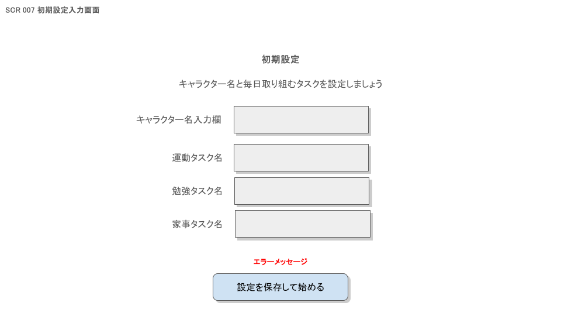

# 画面設計書

## 1. 基本情報

- 画面ID：SCR007
- 画面名：初期設定入力画面
- 対応URL：/home/initial-setup
- 画面の目的：キャラクター名とカテゴリ別のタスク名を登録する
- 利用対象者：ログイン後、初期設定未完了の一般ユーザー
- 関連機能：キャラクター名の更新、タスク名の更新
- 備考：初期設定済みユーザーがアクセスした場合はSCR008へリダイレクト

---

## 2. 画面概要

- この画面で実現すること：キャラクター名（DisplayName）と3カテゴリ（運動・勉強・家事）のタスク名を入力して初期設定を完了する
- 表示タイミング：ログイン後、AspNetUsers.IsInit = false の場合
- 前画面：SCR001 ログイン画面
- 次画面：SCR008 ホーム画面
- 遷移条件：登録ボタン押下かつバリデーション通過、登録成功

---

## 3. 画面レイアウト

### 3.1 レイアウト概要

- ヘッダー：なし（初期設定専用画面のためシンプルに）
- メイン領域：キャラクター名入力、タスク名入力フォーム（運動・勉強・家事）
- フッター：なし
- サイドバー：なし
- モーダル有無：なし

### 3.2 画面イメージ

---

## 4. 表示項目一覧

| No  | 項目ID | 項目名               | 種別             | 表示内容                                               | 初期値 | 表示条件 | 備考 |
| --- | ------ | -------------------- | ---------------- | ------------------------------------------------------ | ------ | -------- | ---- |
| 1   | LBL001 | 画面タイトル         | ラベル           | 「初期設定」                                           | -      | 常時     |      |
| 2   | LBL002 | 説明文               | ラベル           | 「キャラクター名と毎日取り組むタスクを設定しましょう」 | -      | 常時     |      |
| 3   | LBL003 | キャラクター名ラベル | ラベル           | 「キャラクター名」                                     | -      | 常時     |      |
| 4   | INP001 | キャラクター名       | テキストボックス | キャラクター名入力欄                                   | 空     | 常時     |      |
| 5   | LBL004 | 運動タスクラベル     | ラベル           | 「運動タスク名」                                       | -      | 常時     |      |
| 6   | INP002 | 運動タスク名         | テキストボックス | 運動カテゴリのタスク名入力欄                           | 空     | 常時     |      |
| 7   | LBL005 | 勉強タスクラベル     | ラベル           | 「勉強タスク名」                                       | -      | 常時     |      |
| 8   | INP003 | 勉強タスク名         | テキストボックス | 勉強カテゴリのタスク名入力欄                           | 空     | 常時     |      |
| 9   | LBL006 | 家事タスクラベル     | ラベル           | 「家事タスク名」                                       | -      | 常時     |      |
| 10  | INP004 | 家事タスク名         | テキストボックス | 家事カテゴリのタスク名入力欄                           | 空     | 常時     |      |
| 11  | BTN001 | 登録ボタン           | ボタン           | 「設定を保存して始める」                               | -      | 常時     |      |
| 12  | MSG001 | エラーメッセージ     | エラーメッセージ | バリデーション・登録失敗エラー                         | -      | エラー時 |      |

---

## 5. 入力項目一覧

| No  | 項目ID | 項目名         | 入力形式 | 必須 | 桁数上限 | 入力制約     | バリデーション                                     | 備考                          |
| --- | ------ | -------------- | -------- | ---- | -------- | ------------ | -------------------------------------------------- | ----------------------------- |
| 1   | INP001 | キャラクター名 | text     | ○    | 32文字   | 空白文字不可 | 必須チェック、文字数上限チェック、空白文字チェック | AspNetUsers.DisplayNameに保存 |
| 2   | INP002 | 運動タスク名   | text     | ○    | 100文字  | -            | 必須チェック、文字数上限チェック                   | Tasks.Category=0 に保存       |
| 3   | INP003 | 勉強タスク名   | text     | ○    | 100文字  | -            | 必須チェック、文字数上限チェック                   | Tasks.Category=1 に保存       |
| 4   | INP004 | 家事タスク名   | text     | ○    | 100文字  | -            | 必須チェック、文字数上限チェック                   | Tasks.Category=2 に保存       |

---

## 6. ボタン・リンク一覧

| No  | 項目ID | 名称                 | 種別   | 押下時処理                               | 遷移先           | 活性条件 | 備考                       |
| --- | ------ | -------------------- | ------ | ---------------------------------------- | ---------------- | -------- | -------------------------- |
| 1   | BTN001 | 設定を保存して始める | ボタン | フォームをPOST送信、初期設定登録処理実行 | SCR008（成功時） | 常時活性 | 失敗時は同画面にエラー表示 |

---

## 7. 業務ルール

- ログイン済みユーザーのみアクセス可能
- AspNetUsers.IsInit = true のユーザーがアクセスした場合はSCR008へリダイレクトする
- DisplayName（キャラクター名）はAspNetUsersに保存する
- タスク名はTasksテーブルにカテゴリ別（0=運動、1=勉強、2=家事）で更新する
- 登録処理はトランザクション内で実行し、完了後にAspNetUsers.IsInit を true に更新する

---

## 8. バリデーション

| No  | 項目名         | チェック内容       | エラーメッセージ                                     | チェックタイミング |
| --- | -------------- | ------------------ | ---------------------------------------------------- | ------------------ |
| 1   | キャラクター名 | 必須チェック       | 「キャラクター名を入力してください」                 | 送信時             |
| 2   | キャラクター名 | 文字数上限チェック | 「キャラクター名は32文字以内で入力してください」     | 送信時             |
| 3   | キャラクター名 | 空白文字チェック   | 「キャラクター名に空白文字を含めることはできません」 | 送信時             |
| 4   | 運動タスク名   | 必須チェック       | 「運動タスク名を入力してください」                   | 送信時             |
| 5   | 運動タスク名   | 文字数上限チェック | 「タスク名は100文字以内で入力してください」          | 送信時             |
| 6   | 勉強タスク名   | 必須チェック       | 「勉強タスク名を入力してください」                   | 送信時             |
| 7   | 勉強タスク名   | 文字数上限チェック | 「タスク名は100文字以内で入力してください」          | 送信時             |
| 8   | 家事タスク名   | 必須チェック       | 「家事タスク名を入力してください」                   | 送信時             |
| 9   | 家事タスク名   | 文字数上限チェック | 「タスク名は100文字以内で入力してください」          | 送信時             |

---

## 9. メッセージ一覧

| No  | メッセージID | 種別   | 表示内容                                                                   | 表示条件               |
| --- | ------------ | ------ | -------------------------------------------------------------------------- | ---------------------- |
| 1   | ERR001       | エラー | 入力内容に誤りがあります。確認してください。                               | バリデーションエラー時 |
| 2   | ERR002       | エラー | 設定の保存中にエラーが発生しました。しばらく経ってから再度お試しください。 | サーバーエラー時       |

---

## 10. 画面遷移

| No  | 操作                           | 条件                         | 遷移先画面ID | 遷移先画面名               |
| --- | ------------------------------ | ---------------------------- | ------------ | -------------------------- |
| 1   | 設定を保存して始めるボタン押下 | バリデーション通過、登録成功 | SCR008       | ホーム画面                 |
| 2   | 画面表示時                     | 初期設定済みの場合           | SCR008       | ホーム画面（リダイレクト） |
| 3   | DBサービス障害発生             | DB接続不可                   | SCR900       | サービス利用不可画面       |

---

## 11. API・サーバー処理

| No  | 処理名       | API/処理概要                                                                                  | HTTPメソッド | エンドポイント        | 備考                                                                     |
| --- | ------------ | --------------------------------------------------------------------------------------------- | ------------ | --------------------- | ------------------------------------------------------------------------ |
| 1   | 初期設定登録 | キャラクター名をAspNetUsersに、タスク名をTasksテーブルに保存する。CharacterStats・UnallocatedPointsも新規作成する | POST         | /home/initial-setup   | トランザクション内で一括保存。完了後にAspNetUsers.IsInitをtrueに更新する |

---

## 12. 使用テーブル

| No  | テーブル名        | 用途                                             |
| --- | ----------------- | ------------------------------------------------ |
| 1   | AspNetUsers       | DisplayName（キャラクター名）・IsInit の更新     |
| 2   | Tasks             | タスク名の登録（運動・勉強・家事の3件を新規作成） |
| 3   | CharacterStats    | 初期ステータスの作成（全ステータス初期値 10）    |
| 4   | UnallocatedPoints | 初期ポイントの作成（全ポイント 0）               |

---

## 13. 権限制御

- 未ログイン時のアクセス可否：不可（SCR001へリダイレクト）
- ログイン必須：要
- 本人データのみ参照可能か：はい（ログインユーザーのデータのみ操作）
- 管理者権限要否：不要

---

## 14. 例外・異常系

- DB接続失敗時：SCR900（サービス利用不可画面）へ遷移
- 不正な入力時：エラーメッセージを表示し同画面に留まる
- 認証切れ時：SCR001（ログイン画面）へリダイレクト
- 対象データなし時：該当なし
- 想定外エラー時：エラーメッセージを表示し同画面に留まる

---

## 15. 備考・補足

- 補足事項：タスク名の編集機能は現バージョンでは対象外
- 今後の拡張予定：タスク名の編集機能、キャラクター名の変更機能
