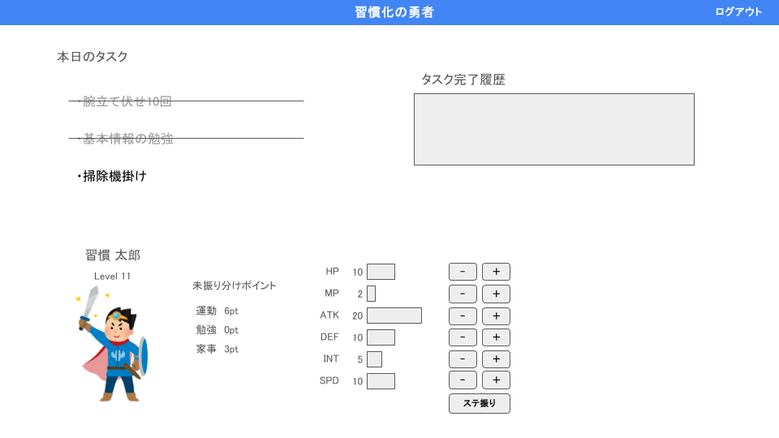

# 画面設計書

## 1. 基本情報

- 画面ID：SCR008
- 画面名：ホーム画面
- 対応URL：/home
- 画面の目的：メインの操作画面。タスク一覧の表示・完了操作、キャラクターステータスの確認・ポイント振り分けを行う
- 利用対象者：ログイン済みかつ初期設定完了済みの一般ユーザー
- 関連機能：タスクの表示、タスクの完了、キャラクターのステータス表示、ステータスポイント付与、ステータスポイントの振り分け、過去のタスク履歴表示
- 備考：本システムのメイン画面。ログイン後に最初に表示される

---

## 2. 画面概要

- この画面で実現すること：本日のタスク一覧表示・完了操作、キャラクターステータス確認・ポイント振り分け、過去タスク完了率の可視化（草）
- 表示タイミング：ログイン後（初期設定済みの場合）、またはSCR007（初期設定入力画面）での設定完了後
- 前画面：SCR001 ログイン画面 / SCR007 初期設定入力画面
- 次画面：SCR001 ログイン画面（ログアウト時）
- 遷移条件：ログアウトボタン押下

---

## 3. 画面レイアウト

### 3.1 レイアウト概要

- ヘッダー：アプリ名「習慣化の勇者」、ログアウトボタンを表示
- メイン領域：タスク一覧エリア、キャラクターステータスエリア、過去履歴（草）エリア
- フッター：なし
- サイドバー：なし
- モーダル有無：なし

### 3.2 画面イメージ

---

## 4. 表示項目一覧

| No  | 項目ID | 項目名                             | 種別   | 表示内容                             | 初期値 | 表示条件 | 備考                                                                                             |
| --- | ------ | ---------------------------------- | ------ | ------------------------------------ | ------ | -------- | ------------------------------------------------------------------------------------------------ |
| 1   | LBL001 | アプリ名                           | ラベル | 「習慣化の勇者」                     | -      | 常時     | ヘッダー                                                                                         |
| 2   | LNK001 | ログアウトリンク                   | リンク | 「ログアウト」                       | -      | 常時     | ヘッダー                                                                                         |
| 3   | LBL002 | 本日のタスクラベル                 | ラベル | 「本日のタスク」                     | -      | 常時     | タスクエリア                                                                                     |
| 4   | BTN001 | 運動タスク                         | ボタン | タスク名                             | -      | 常時     | 完了済みはグレーアウト、斜線等で分かりやすく                                                     |
| 5   | BTN002 | 勉強タスク                         | ボタン | タスク名                             | -      | 常時     | 完了済みはグレーアウト、斜線等で分かりやすく                                                     |
| 6   | BTN003 | 家事タスク                         | ボタン | タスク名                             | -      | 常時     | 完了済みはグレーアウト、斜線等で分かりやすく                                                     |
| 7   | LBL003 | キャラクター名                     | ラベル | ログインユーザーのキャラクター名     | -      | 常時     | ステータスエリア                                                                                 |
| 8   | LBL004 | キャラクターレベル                 | ラベル | 「Level {level}」                    | -      | 常時     | ステータスエリア TaskCompletionLogsテーブルからタスクの完了件数を取得して、それをレベルとする |
| 9   | LBL005 | HP表示                             | ラベル | HP：[値]                             | -      | 常時     | ステータスエリア                                                                                 |
| 10  | LBL006 | MP表示                             | ラベル | MP：[値]                             | -      | 常時     | ステータスエリア                                                                                 |
| 11  | LBL007 | ATK（攻撃力）表示                  | ラベル | ATK：[値]                            | -      | 常時     | ステータスエリア                                                                                 |
| 12  | LBL008 | DEF（防御力）表示                  | ラベル | DEF：[値]                            | -      | 常時     | ステータスエリア                                                                                 |
| 13  | LBL009 | SPD（速度）表示                    | ラベル | SPD：[値]                            | -      | 常時     | ステータスエリア                                                                                 |
| 14  | LBL010 | MATK（魔法攻撃力）表示             | ラベル | MATK：[値]                           | -      | 常時     | ステータスエリア                                                                                 |
| 15  | BTN004 | ステータス振り分け＋ボタン（HP）   | ボタン | 「+」                                | -      | 常時     | ステータスエリア                                                                                 |
| 16  | BTN005 | ステータス振り分け＋ボタン（MP）   | ボタン | 「+」                                | -      | 常時     | ステータスエリア                                                                                 |
| 17  | BTN006 | ステータス振り分け＋ボタン（ATK）  | ボタン | 「+」                                | -      | 常時     | ステータスエリア                                                                                 |
| 18  | BTN007 | ステータス振り分け＋ボタン（DEF）  | ボタン | 「+」                                | -      | 常時     | ステータスエリア                                                                                 |
| 19  | BTN008 | ステータス振り分け＋ボタン（SPD）  | ボタン | 「+」                                | -      | 常時     | ステータスエリア                                                                                 |
| 20  | BTN009 | ステータス振り分け＋ボタン（MATK） | ボタン | 「+」                                | -      | 常時     | ステータスエリア                                                                                 |
| 21  | BTN010 | ステータス振り分け-ボタン（HP）    | ボタン | 「-」                                | -      | 常時     | ステータスエリア                                                                                 |
| 22  | BTN011 | ステータス振り分け-ボタン（MP）    | ボタン | 「-」                                | -      | 常時     | ステータスエリア                                                                                 |
| 23  | BTN012 | ステータス振り分け-ボタン（ATK）   | ボタン | 「-」                                | -      | 常時     | ステータスエリア                                                                                 |
| 24  | BTN013 | ステータス振り分け-ボタン（DEF）   | ボタン | 「-」                                | -      | 常時     | ステータスエリア                                                                                 |
| 25  | BTN014 | ステータス振り分け-ボタン（SPD）   | ボタン | 「-」                                | -      | 常時     | ステータスエリア                                                                                 |
| 26  | BTN015 | ステータス振り分け-ボタン（MATK）  | ボタン | 「-」                                | -      | 常時     | ステータスエリア                                                                                 |
| 27  | BTN016 | ステータス振り分け確定ボタン       | ボタン | 「振り分けを適用する」               | -      | 常時     | ステータスエリア                                                                                 |
| 28  | LBL011 | 未振り分けポイントラベル           | ラベル | 「未振り分けポイント」               | -      | 常時     | ステータスエリア                                                                                 |
| 29  | LBL012 | 運動ポイント表示                   | ラベル | 運動：[ExercisePoints]pt             | -      | 常時     | ステータスエリア                                                                                 |
| 30  | LBL013 | 勉強ポイント表示                   | ラベル | 勉強：[StudyPoints]pt                | -      | 常時     | ステータスエリア                                                                                 |
| 31  | LBL014 | 家事ポイント表示                   | ラベル | 家事：[HouseworkPoints]pt            | -      | 常時     | ステータスエリア                                                                                 |
| 32  | LBL015 | タスク履歴ラベル                   | ラベル | 「タスク完了履歴」                   | -      | 常時     | 履歴エリア                                                                                       |
| 33  | CLD001 | 完了履歴カレンダー                 | 未定   | 未定、過去のタスク完了状況の表示想定 | -      | 常時     | 直近数ヶ月分を表示                                                                               |

---

## 5. 入力項目一覧

| No  | 項目ID | 項目名       | 入力形式 | 必須 | 桁数上限 | 入力制約 | バリデーション | 備考           |
| --- | ------ | ------------ | -------- | ---- | -------- | -------- | -------------- | -------------- |
| -   | -      | 入力項目なし | -        | -    | -        | -        | -              | 表示のみの画面 |

---

## 6. ボタン・リンク一覧

| No  | 項目ID | 名称                              | 種別   | 押下時処理                              | 遷移先 | 活性条件                                   | 備考 |
| --- | ------ | --------------------------------- | ------ | --------------------------------------- | ------ | ------------------------------------------ | ---- |
| 1   | LNK001 | ログアウトリンク                  | リンク | ログアウト処理実行                      | SCR001 | 常時活性                                   |      |
| 2   | BTN001 | 運動タスク                        | ボタン | タスク完了API呼び出し、画面を更新       | 同画面 | タスク未完了時                             |      |
| 3   | BTN002 | 勉強タスク                        | ボタン | タスク完了API呼び出し、画面を更新       | 同画面 | タスク未完了時                             |      |
| 4   | BTN003 | 家事タスク                        | ボタン | タスク完了API呼び出し、画面を更新       | 同画面 | タスク未完了時                             |      |
| 5   | BTN004 | ステータス振り分け+ボタン（HP）   | ボタン | ステータスを仮振り分け、画面を更新      | 同画面 | 未振り分け運動ポイントが1以上              |      |
| 6   | BTN005 | ステータス振り分け+ボタン（MP）   | ボタン | ステータスを仮振り分け、画面を更新      | 同画面 | 未振り分け勉強ポイントが1以上              |      |
| 7   | BTN006 | ステータス振り分け+ボタン（ATK）  | ボタン | ステータスを仮振り分け、画面を更新      | 同画面 | 未振り分け運動ポイントが1以上              |      |
| 8   | BTN007 | ステータス振り分け+ボタン（DEF）  | ボタン | ステータスを仮振り分け、画面を更新      | 同画面 | 未振り分け家事ポイントが1以上              |      |
| 9   | BTN008 | ステータス振り分け+ボタン（SPD）  | ボタン | ステータスを仮振り分け、画面を更新      | 同画面 | 未振り分け家事ポイントが1以上              |      |
| 10  | BTN009 | ステータス振り分け+ボタン（MATK） | ボタン | ステータスを仮振り分け、画面を更新      | 同画面 | 未振り分け勉強ポイントが1以上              |      |
| 11  | BTN010 | ステータス振り分け-ボタン（HP）   | ボタン | ステータスを仮振り分け、画面を更新      | 同画面 | HPの仮振り分けポイントが1以上              |      |
| 12  | BTN011 | ステータス振り分け-ボタン（MP）   | ボタン | ステータスを仮振り分け、画面を更新      | 同画面 | MPの仮振り分けポイントが1以上              |      |
| 13  | BTN012 | ステータス振り分け-ボタン（ATK）  | ボタン | ステータスを仮振り分け、画面を更新      | 同画面 | ATKの仮振り分けポイントが1以上             |      |
| 14  | BTN013 | ステータス振り分け-ボタン（DEF）  | ボタン | ステータスを仮振り分け、画面を更新      | 同画面 | DEFの仮振り分けポイントが1以上             |      |
| 15  | BTN014 | ステータス振り分け-ボタン（SPD）  | ボタン | ステータスを仮振り分け、画面を更新      | 同画面 | SPDの仮振り分けポイントが1以上             |      |
| 16  | BTN015 | ステータス振り分け-ボタン（MATK） | ボタン | ステータスを仮振り分け、画面を更新      | 同画面 | MATKの仮振り分けポイントが1以上            |      |
| 17  | BTN016 | ステータス振り分け確定ボタン      | ボタン | ポイント振り分けAPI呼び出し、画面を更新 | -      | 仮振り分けポイントが1以上（+ボタン操作後） |      |

---

## 7. 業務ルール

- タスクの完了判定：`Tasks.LastCompletedDate` が本日の日付と一致する場合に「完了済み」とする
- 日付が変わると自動的にタスクが「未完了」に戻る（クエリ時に判定、DBの更新は不要）
- タスク完了時：対応カテゴリの `UnallocatedPoints` を +3 する
- 同一タスクを同日中に2回完了することはできない
- ステータスポイントの振り分け：1ポイント消費で対象ステータス +1
- 振り分け可能なステータスはカテゴリ別に制限（運動→HP/ATK、勉強→MP/MATK、家事→DEF/SPD）
- ログインしていないユーザーはSCR001へリダイレクト
- 初期設定未完了のユーザーはSCR007へリダイレクト

---

## 8. バリデーション

| No  | 項目名 | チェック内容 | エラーメッセージ | チェックタイミング |
| --- | ------ | ------------ | ---------------- | ------------------ |
| -   | -      | 入力項目なし | -                | -                  |

---

## 9. メッセージ一覧

| No  | メッセージID | 種別   | 表示内容                                       | 表示条件                    |
| --- | ------------ | ------ | ---------------------------------------------- | --------------------------- |
| 1   | ERR001       | エラー | タスクの完了処理中にエラーが発生しました       | タスク完了APIエラー時       |
| 2   | ERR002       | エラー | ポイントの振り分け処理中にエラーが発生しました | ポイント振り分けAPIエラー時 |

---

## 10. 画面遷移

| No  | 操作                 | 条件                 | 遷移先画面ID | 遷移先画面名                     |
| --- | -------------------- | -------------------- | ------------ | -------------------------------- |
| 1   | ログアウトボタン押下 | なし                 | SCR001       | ログイン画面                     |
| 2   | 画面表示時           | 未ログインの場合     | SCR001       | ログイン画面（リダイレクト）     |
| 3   | 画面表示時           | 初期設定未完了の場合 | SCR007       | 初期設定入力画面（リダイレクト） |
| 4   | DBサービス障害発生   | DB接続不可           | SCR900       | サービス利用不可画面             |

---

## 11. API・サーバー処理

| No  | 処理名             | API/処理概要                                                     | HTTPメソッド | エンドポイント               | 備考                                                                                                         |
| --- | ------------------ | ---------------------------------------------------------------- | ------------ | ---------------------------- | ------------------------------------------------------------------------------------------------------------ |
| 1   | ホーム情報取得     | タスク一覧、キャラクターステータス、未振り分けポイント、レベルを取得する | GET          | /home                        | ページ初期表示時。レベルはTaskCompletionLogsのCOUNT(UserId = ログインユーザー)で算出する |
| 2   | タスク完了         | 指定タスクを完了状態にし、対応ポイントを+3する                   | POST         | /api/tasks/{taskId}/complete | LastCompletedDateを本日の日付に更新、UnallocatedPointsを+3、TaskCompletionLogsにレコードを登録（INSERT）する |
| 3   | ポイント振り分け   | 指定ポイントをステータスに振り分ける                             | POST         | /api/character/allocate      | UnallocatedPointsを減算、CharacterStatsを加算                                                                |
| 4   | タスク完了履歴取得 | 過去の完了履歴データを取得する                                   | GET          | /api/tasks/history           | TaskCompletionLogsを集計して返す                                                                             |
| 5   | ログアウト         | セッション・Cookieを無効化する                                   | POST         | /account/logout              | ASP.NET Core Identityの標準処理                                                                              |

---

## 12. 使用テーブル

| No  | テーブル名         | 用途                                                  |
| --- | ------------------ | ----------------------------------------------------- |
| 1   | AspNetUsers        | キャラクター名（DisplayName）の表示                   |
| 2   | Tasks              | タスク一覧の表示、タスク完了（LastCompletedDate更新） |
| 3   | TaskCompletionLogs | タスク完了履歴の記録・表示（草）・レベル算出（COUNT(*)） |
| 4   | CharacterStats     | キャラクターステータスの表示・更新                    |
| 5   | UnallocatedPoints  | 未振り分けポイントの表示・更新                        |

---

## 13. 権限制御

- 未ログイン時のアクセス可否：不可（SCR001へリダイレクト）
- ログイン必須：要
- 本人データのみ参照可能か：はい（ログインユーザーのデータのみ表示・操作）
- 管理者権限要否：不要

---

## 14. 例外・異常系

- DB接続失敗時：SCR900（サービス利用不可画面）へ遷移
- 不正な入力時：エラーメッセージを表示し同画面に留まる
- 認証切れ時：SCR001（ログイン画面）へリダイレクト
- 対象データなし時：該当なし（初期設定時に必ず作成されるため）
- 想定外エラー時：エラーメッセージを表示し同画面に留まる

---

## 15. 備考・補足

- 補足事項：タスクリセットはバックグラウンドジョブではなく、クエリ時に`LastCompletedDate < 本日`で判定する
- 今後の拡張予定：キャラクターの戦闘システム、ランキング機能、タスク名の編集機能、キャラクター名の変更機能
